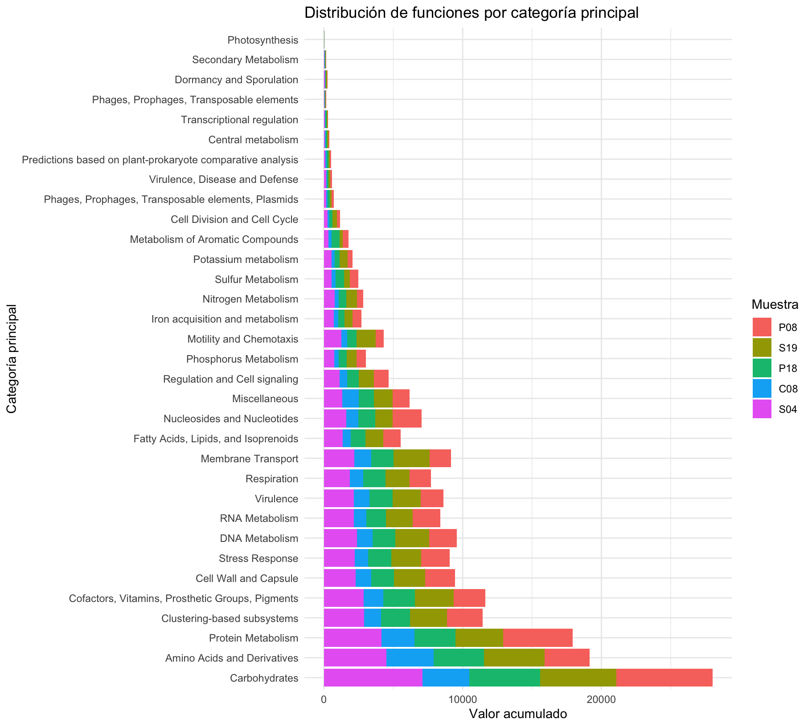
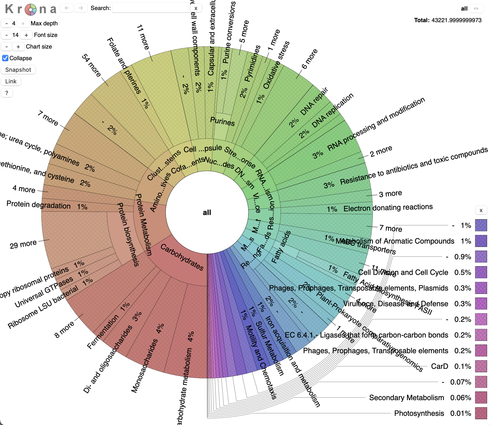

# Clasificación funcional con Superfocus

#### Archivos y programas
Los programas y set de datos ya se encuentran instalados en la imagen virtual **MGlinux18.2** pero la última versión de los datos se pueden bajar de aquí:

- [dietas.v2.tar.gz](https://drive.google.com/file/d/1FRdvMIERJJHSeo15n6vYlTtMvv3G16bZ/view?usp=sharing)
- [SUPERfocus](https://github.com/metageni/SUPER-FOCUS)
- [Krona](https://github.com/marbl/Krona)

***
Podemos **clasificar funcionalmente** metagenomas con [SUPERFOCUS](https://github.com/metageni/SUPER-FOCUS), pero debido al tamaño de la base de datos y la intensidad computacional, no es factible hacerlo en una máquina virtual. El proceso es igual a [FOCUS](Metagenómica/Taxonomic_metaclassification.md) y el resultado es una hoja tipo excel que podemos ver en la subcarpeta `cooked/superfocus/` en el set de datos `dietas.v2.tar.gz`. Este set de datos podemos bajarlo de [GDrive](https://drive.google.com/file/d/1FRdvMIERJJHSeo15n6vYlTtMvv3G16bZ/view?usp=sharing).

Superfocus clasifica cada secuencia siguiendo el esquema de [SEED](https://theseed.org/wiki/Home_of_the_SEED) que está basado en cuatro niveles jerárquicos. Superfocus genera varios archivos pero el principal es `*_All_levels.csv` que tiene tanto el conteo de secuencias como la abundancia relativa para cada muestra. Es conveniente separar estos dos grupos de valores y dejar así dos archivos; éstos son los que ya están en el set de datos (`dietas_numbers.txt` y `dietas_rel_abund.txt`).

***
### Arreglo del archivo `dietas_numbers.txt`

Vamos a graficar estos datos con R para ver las funciones clasificadas en las cinco muestras. Pero antes hay que modificar los nombres de las columnas del archivo dietas_numbers.txt para simplicifarlos y evitar problemas con los espacios. Actualmente están de la siguiente forma:

```
Subsystem Level 1	Subsystem Level 2	Subsystem Level 3	SEED Function	P08	S19	P18	C08	S04

Amino Acids and Derivatives	-	Amino acid racemase	2-methylaconitate_cis-trans_isomerase	0	0.00607096	0	0.000801796	0.004145507

Amino Acids and Derivatives	-	Amino acid racemase	2-methylaconitate_isomerase	0	0.001856409	0.001834223	0	0.000414551
```

Ejecutemos un comando para cambiar los nombres de las columnas:

 ```bash
sed -i 's/Subsystem Level 1/Level1/; s/Subsystem Level 2/Level2/; s/Subsystem Level 3/Level3/; s/SEED Function/SEED_Function/' dietas_numbers.txt
 ```

Ahora tendremos los nombre sin espacios y mas simples:

```
Level1  Level2 Level3 SEED_Function	P08	S19	P18	C08	S04
```
***
### Graficar por funciones

Podemos con R crear una **gráfica de barras apiladas** que nos permita ver las funciones que tiene cada muestra.

Hagamos primero un proyecto en **RStudio** en la carpeta con los archivos de superfocus y carguemos las librerias necesarias:

```bash
library(tidyverse)
library(reshape2)
library(RColorBrewer)
```
Si no tenemos alguna de estas librería en RStudio, hay que instalarlas, p. ej. `install.packages("reshape2"`)

Importemos los datos a R:

```bash
datos <- read.delim("dietas_numbers.txt", sep = "\t", header = TRUE, check.names = FALSE)
```
Agrupar por Level1 y Level2, sumarizando los valores

```bash
plot_data <- data %>% group_by(Level1, Level2) %>% summarise(across(c(P08, S19, P18, C08, S04), sum, na.rm = TRUE)) %>% ungroup()
```
Convertir a formato largo para ggplot
```bash
plot_data_long <- melt(plot_data, id.vars = c("Level1", "Level2"))
```
Gráfico sin facets, mostrando solo Level1
```bash
ggplot(plot_data_long %>%
	group_by(Level1, variable) %>%
	summarise(value = sum(value)) %>%
	ungroup() %>%
# Ordenar los niveles de Level1 por el valor total de cada muestra
	mutate(Level1 = fct_reorder(Level1, value, .desc = TRUE)),
	aes(x = Level1, y = value, fill = variable)) +
	geom_bar(stat = "identity", position = "stack") +
	labs(title = "Distribución de funciones por categoría principal",
	x = "Categoría principal",
	y = "Valor acumulado",
	fill = "Muestra") +
	theme_minimal() +
# Invertir las coordenadas para que el gráfico sea vertical
	coord_flip() +
	theme(axis.text.y = element_text(hjust = 1))
  ```
  ***
Veremos en RStudio una gráfica como esta:



***
### Graficar por muestras

Podemos ahora generar otra gráfica pero por muestras; primero agrupemos las categorías menores para que sea mas sencilla la gráfica, dejaremos solo las 15 mas abundantes y el resto en una sola categoría llamada *Otras categorías*:

```bash
plot_data_perc_sample <- data %>%
  group_by(Level1) %>%
  summarise(across(c(P08, S19, P18, C08, S04), sum, na.rm = TRUE)) %>%
  pivot_longer(cols = -Level1, names_to = "sample", values_to = "value") %>%
  group_by(sample) %>%
  mutate(
    total_sample = sum(value),
    percentage = value/total_sample * 100
  ) %>%
  ungroup() %>%
  # Agrupar categorías menores (top 15)
  mutate(
    Level1 = fct_lump_n(Level1, n = 15, w = value, other_level = "Otras categorías"),
    # ORDEN INVERTIDO: .desc = FALSE para que la mayor quede abajo
    Level1 = fct_reorder(Level1, value, .fun = sum, .desc = FALSE)
  )
```
Crear paleta de colores:

```bash
n_categories <- n_distinct(plot_data_perc_sample$Level1)
color_palette <- colorRampPalette(brewer.pal(12, "Paired"))(n_categories)
```
Creación del gráfico:

```bash
ggplot(plot_data_perc_sample, aes(x = sample, y = percentage, fill = Level1)) +
  geom_col(position = "stack", width = 0.85) +
  labs(
    title = "Composición porcentual por muestra",
    subtitle = "15 principales categorias, el resto agrupadas en Otras",
    x = "Muestra",
    y = "Porcentaje",
    fill = "Categorías Funcionales"
  ) +
  theme_minimal(base_size = 12) +
  theme(
    axis.text.x = element_text(angle = 0, hjust = 1, vjust = 1.1, face = "bold", size = 12),
    legend.position = "right",
    plot.title = element_text(face = "bold", hjust = 0.5),
    plot.subtitle = element_text(hjust = 0.5, color = "gray40", size = 10)
  ) +
  scale_y_continuous(
    labels = percent_format(scale = 1),
    expand = expansion(mult = c(0, 0.05))
  ) +
  scale_fill_manual(values = color_palette) +
  guides(fill = guide_legend(
    ncol = 1,
    reverse = TRUE  # Esto invierte también el orden en la leyenda
  ))
```
Se debe crear una gráfica como la siguiente:


***
### Krona
También podemos generar una gráfica tipo [Krona](https://github.com/marbl/Krona) fácilmente; primero tenemos que extraer los datos para cada una de las muestras (con `cut`) y cambiar el formato (primero los datos y después los niveles, con `awk`):

```bash
cut -f1-5 dietas_numbers.txt | awk -v OFS='\t' 'BEGIN {FS="\t"}; {print $5, $1, $2, $3, $4}' | sed 1,4d > P08.krona
```
teniendo así un archivo para krona, generemos la gráfica interactiva krona:

```bash
ktImportText -o P08.html P08.krona
```
Este gráfico podemos visualizarlo con cualquier navegador. Para crear las gráficas de las demás muestras, solo tenemos que cortar las columnas correspondientes del archivo `dietas_numbers.txt`, p. ej. para la muestra S19: `cut -f1-4,6 dietas_numbers.txt ...` el resto del comando es igual al anterior, salvo el archivo de salida obviamente.
***


***
