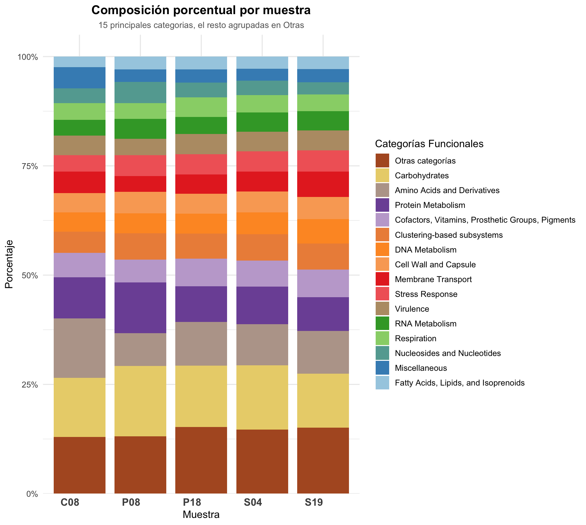

# Dietas Visualización

Visualización de datos funcionales a partir de un archivo tabulado con conteos por categoría generado por SUPERfocus a partir del set de datos `dietas.v2`

## 🧪 Requisitos

Este script usa R y las siguientes bibliotecas:

```r
install.packages(c("ggplot2", "reshape2", "scales"))
```

## 📂 Estructura del repositorio

```
dietas-viz/
├── Graficacion_superfocus.md
├── scripts/
│   └── dietas_graficos.R
├── data/
│   └── dietas_numbers.txt
├── plots/
│   └── grafica1_orden_ascendente.png
│   └── grafica2_todas_categorias.png
```

## ▶️ Cómo ejecutar

1. Crear un proyecto nuevo en `RStudio` dentro de la carpeta `Documentos/dietas.v2/cooked/superfocus`
2. Abrir el script `dietas_graficos.R` y ejecutarlo en la consola:

```r
source("dietas_graficos.R")
```

## ⚙️ Parámetros

- `top_n`: Número de categorías más frecuentes a visualizar (por defecto 15)
- El resto de categorías se agrupan bajo "Otras"

Puedes cambiar el valor en:
```r
porcentual_df <- preparar_datos_porcentuales(df_long, top_n = 15)
```

## 💾 Exportación

El script genera dos visualizaciones:
- `grafica1_orden_ascendente.png`: Distribución absoluta por categoría (ordenada ascendente)


- `grafica2_todas_categorias.png`: Composición porcentual por muestra (top-N + Otras)


---

**Licencia:** MIT

**Autor:** Bruno Gomez-Gil
