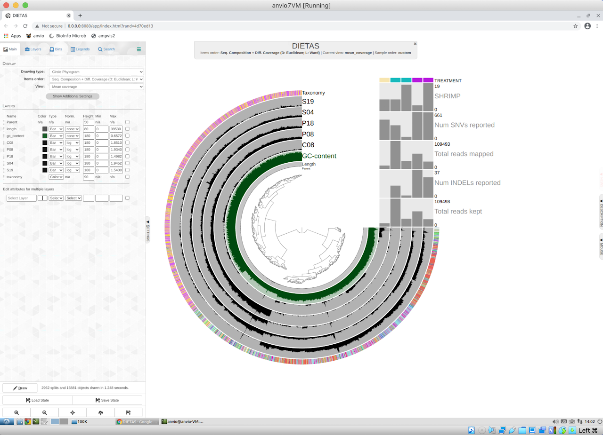

# Metagenómica shotgun con Anvi'o

Haremos un análisis metagenómico completo de unas muestras de heces de camarón con la plataforma [Anvi'o](https://anvio.org/).
***
#### Datos y programas
- [dietas.v2.tar.gz](https://figshare.com/s/4e700c8c9ce853e74827). Set de datos.
- [Megahit](https://github.com/voutcn/megahit). Para ensamble de metagenomas.
- [Anvi'o](https://anvio.org/). Análisis metagenómico que oncluye varios programas preinstalados.

***
#### Obtención de Datos
Primero descomprimamos el set de datos de la dietas en la carpeta `Documents`:
```bash
tar xzf dietas.v2.tar.gz
```
Tendremos las secuencias de los cinco metagenomas en la carpeta `seqs` y diversos análisis ya hechos en la carpeta `cooked`. También tenemos los metadatos (`metadata.txt`) y una descripción del experimento (`Dietas_descripcion.md`).
***
### Ensamble de contigs
Tenemos primero que crear un listado de las muestras que usaremos para cada uno de las pareadas; para esto tenemos que tener todas los archivos en una carpeta o dentro de subdirectorios pero que los archivos pareados tengan algo que los distinga y que sea del mismo tipo siempre. Por ejemplo: `Sample01.R1.fastq` y `Sample01.R2.fastq`.

Con los siguientes comandos podemos crear una variable para que automáticamente genere un listado para cada archivo pareado separado por comas que se encuentren en subcarpetas:
```bash
R1=$(find . -name '*.R1.*' | tr '\n' ',' | sed s'/.$//; s/\.\///g')
```
```bash
R2=$(find . -name '*.R2.*' | tr '\n' ',' | sed s'/.$//; s/\.\///g')
```

Y entonces estas variables ya las podemos usar en el comando de `megahit`:
```bash
megahit -1 $R1 -2 $R2 --min-contig-len 1000 -m 0.8 -t 2 -o megahit
```
Este análisis puede tardar varios minutos dependiendo del número de núcleos que le hayamos asignado; nos generará una carpeta llamada megahit con archivos, el ensamble estará en `final.contigs.fa`, podemos inspeccionarlo y ver que tiene 2,964 contigs y una N50 = 1,612 pb. Podemos ver también que el encabezado (heading) de los contigs es así:
```bash
grep ">" megahit/final.contigs.fa | head -3
```
```text
>k99_69 flag=1 multi=3.0000 len=1393
>k99_70 flag=1 multi=2.0000 len=1036
>k99_77 flag=1 multi=3.0000 len=1587
```
Este tipo de encabezado no le gusta a **Anvio**, por lo que tenemos que cambiarlo a algo mas sencillo, sin espacios, corto y con números consecutivos:
```bash
awk '/^>/{print ">'contig'_"++i; next}{print}' megahit/final.contigs.fa > contigs.fa
```
Ahora tendremos los encabezados mas sencillos:
```bash
grep ">" contigs.fa | head -3
```
> contig_1
> contig_2
> contig_3

Importante, megahit crea muchos archivos intermedios grandes que solo nos ocupan espacio, y no tenemos mucho en la imagen virtual, borrémoslos, pero antes asegurémonos que tenemos el archivo contigs.fa (generado anteriormente) en la carpeta. Como comprobación de que tanto espacio ocupa, chequemos el tamaño con `du`:
```bash
du -h megahit/
```

>280M  megahit/intermediate_contigs

>285M megahit/

Ahora si borrémoslo:
```bash
rm -fr megahit/
```
***
### Mapeo de contigs

Teniendo un archivo de contigs formado con todos los metagenomas, debemos ahora mapear cada metagenoma a ese esos contigs, esto nos dirá cuantas y cuales secuencias de cada metagenoma contribuyeron a cada contig, primero tenemos que crear un índice:
```bash
bowtie2-build contigs.fa contigs
```
Ahora si mapeamos los metagenomas usando ese índice (contigs):
```bash
bowtie2 --threads 2 -x contigs -f sample1.fna -S sample1.sam
```

Esto tenemos que hacer para cada uno de las cinco metagenomas. Como estos pasos siguientes hay que hacerlos para cada una de las cinco carpetas y se vuelve tedioso, podemos hacer una sencillo script para que vaya entrando a las carpetas y mapeando, cambiando formato e inicializando los archivos bam; el script **[mapper.sh](scripts/mapper.sh)** hace esto. Bajemos el script, hagámoslo ejecutable (`chmod +x mapper.sh`)y corrámoslo en la carpeta donde tengamos los archivos `contigs.bt2`. Si corremos el script, al final podemos saltarnos lo siguiente e ir a **Creación de base de datos**.
***
Si se prefiere, hagamos paso a paso cada mapeo:
```bash
bowtie2 --threads 2 -x contigs -1 C08/C08.R1.fastq -2 C08/C08.R2.fastq -S C08.sam
```
```bash
bowtie2 --threads 2 -x contigs -1 P08/P08.R1.fastq -2 P08/P08.R2.fastq -S P08.sam
```
```bash
bowtie2 --threads 2 -x contigs -1 P18/P18.R1.fastq -2 P18/P18.R2.fastq -S P18.sam
```
```bash
bowtie2 --threads 2 -x contigs -1 S04/S04.R1.fastq -2 S04/S04.R2.fastq -S S04.sam
```
```bash
bowtie2 --threads 2 -x contigs -1 S19/S19.R1.fastq -2 S19/S19.R2.fastq -S S19.sam
```
Para lo que sigue, debemos activar el ambiente `Anvio`:
```bash
conda activate anvio-8
```
Nótese que ahora aparece (`anvio-8`) antes del prompt `$`.

Convertir los archivos generados a formato sam:
```bash
for f in *.sam; do samtools view -F 4 -bS $f > $f.raw; done
```
Ahora debemos *inicializar* los archivos generado con Anvio:
```bash
for f in *.raw; do anvi-init-bam $f -o $f.bam; done
```
Limpieza de archivo ya no necesarios:
```bash
rm *.raw *.sam
```
Como los nombres de los archivos van creciendo, es conveniente acortarlos con `rename`:
```bash
rename 's/.sam.raw.bam/.bam/' *.bam
```
Los archivos bai:
```bash
rename 's/.sam.raw.bam.bai/.bai/' *.bai
```
Ahora tendremos nombre mas cortos para los archivos `.bam` y `.bai`
***
### Creación de base de datos
```bash
anvi-gen-contigs-database -f contigs.fa -o contigs.db
```
Posteriormente es buena idea buscar hidden Markov models (hmm) en nuestros contigs, éstos son Single Copy Genes (SCG) para bacterias y nos ayudarán a saber si un genoma bacteriano encontrado está "completo" o no:
```bash
anvi-run-hmms -c contigs.db -I Bacteria_71 -T 2
```
Podemos asignarle una clasificación taxonómica a estos SCG:
```bash
anvi-run-scg-taxonomy -c contigs-db
```
En caso que marque error porque no encuentra las bases de datos, habrá que instalarlas corriendo el script:
```bash
run_me_first
```

También podemos extraer las secuencias de los genes existentes en la base de datos para una posterior clasificación taxonómica o funcional de éstos:
```bash
anvi-get-sequences-for-gene-calls -c contigs.db -o gene-calls.fa
```
***

### Perfil para cada muestra
Teniendo ya todos los datos, debemos crear un "profile" para cada muestra, tener cuidado por que el subdirectorio va  a ser borrado y crear uno nuevo, pero de todos modos ya no necesitamos los archivos `fastq` y solo nos quitan nuestro preciado espacio.
```bash
anvi-profile -i C08.bam -c contigs.db --output-dir C08 --sample-name C08 -W -T 2
```
Esto hay que hacerlo para cada una de las cinco muestras por separado:
```bash
anvi-profile -i P08.bam -c contigs.db --output-dir P08 --sample-name P08 -W -T 2
```
```bash
anvi-profile -i P18.bam -c contigs.db --output-dir P18 --sample-name P18 -W -T 2
```
```bash
anvi-profile -i S04.bam -c contigs.db --output-dir S04 --sample-name S04 -W -T 2
```
```bash
anvi-profile -i S19.bam -c contigs.db --output-dir S19 --sample-name S19 -W -T 2
```
Luego tenemos que unir todos los cinco perfiles:
```bash
anvi-merge */PROFILE.db -o SAMPLES-MERGED -c contigs.db --sample-name DIETAS
```
##### Limpieza

Ya no necesitamos los archivos `.bam` ni `.bai`, ni los creados durante la generación de índices, podemos eliminarlos:
```bash
rm *.bai *.bam contigs.1.bt2 contigs.2.bt2 contigs.3.bt2 contigs.4.bt2 contigs.rev.*
```
***

#### Taxonomía y funciones
Como no corrimos clasificación taxonómica ni funcional, por falta de espacio en la imagen virtual, no podremos obtener información al respecto en la visualización.
En caso que hallamos corrido la clasificación taxonómica y/o funcional aparte y tengamos el resultado, podemos importarla a la base de datos.
En el set de datos `Dietas.v2.tar.gz` tenemos los archivos pre generados dentro de la carpeta `cooked` y en la subcarpeta (`gene-calls`) que contiene varios archivos:

- `gene-calls.fa` Secuencias de los genes encontrados.
- `gene-calls.tax` Taxonomía asociada a los genes anotados.
- `gene-calls.out` Anotación de los genes sin taxonomía con Kaiju.
- `gene-calls.krona` Archivo para generación de gráfica Krona.
- `gene_KEGG_functions.txt` Archivo con anotaciones KEGG para cada gen.

El archivo `gene-calls.tax`  con la **taxonomía** generada con Kaiju hay que incorporarlo a la base de datos `contigs.db`:
```bash
anvi-import-taxonomy-for-genes -c contigs.db -i cooked/gene-calls/gene-calls.tax -p kaiju --just-do-it
```
Las **funciones** podemos importarlas a nuestra base de datos también desde el archivo `gene_KEGG_functions.txt`:
```bash
anvi-import-functions -c contigs.db -i cooked/gene-calls/gene_KEGG_functions.txt
```
También podemos generar una **gráfica taxonómica Krona** con el archivo `gene-calls.krona`:
```bash
ktImportText -o kaiju_gene_taxonomy.html cooked/gene-calls/gene-calls.krona
```
#### Descripción
Tenemos también un archivo (`Dietas_descripcion.md`) con una breve descripción de los datos y métodos, podemos incluirlos en la base de datos para que sea desplegado en la visualización:
```bash
anvi-update-db-description --description Dietas_descripcion.md SAMPLES-MERGED/PROFILE.db
```
#### Metadatos
Por último podemos importar los metadatos a Anvio:
```bash
anvi-import-misc-data metadata.txt -p SAMPLES-MERGED/PROFILE.db --target-data-table layers
```
***

### Visualización de resultados

Por último podemos ver el resultado del análisis en una gráfica interactiva en el navegador:
```bash
anvi-interactive -c contigs.db -p SAMPLES-MERGED/PROFILE.db --taxonomic-level t_species
```
***
Si todo salió bien, debemos ver una imagen semejante a la siguiente:


***
