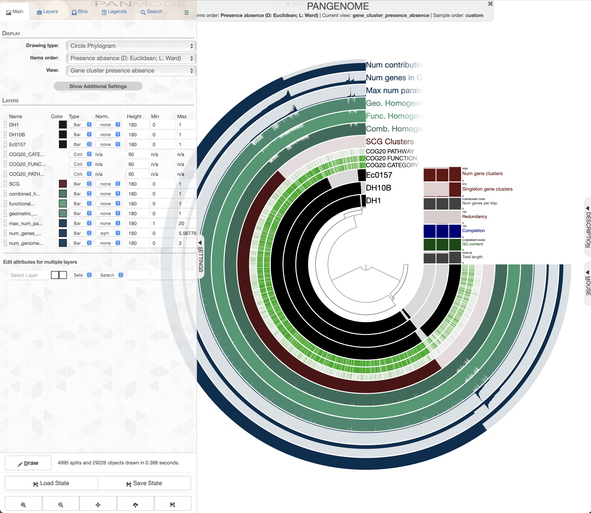

# Pangenoma con Anvi'o

[Anvi'o](https://anvio.org/) también puede realizar filogenómica y pangenomas de una manera sencilla pero muy potente. Una descripción más detallada se encuentra en [Phylogenomics](https://merenlab.org/2017/06/07/phylogenomics/).

Primero tenemos que tener obviamente los genomas a analizar en formato `fasta`, usaremos el set de datos que contiene tres genomas de *E. coli*; los cuales los podemos decargar de [aquí](https://drive.google.com/file/d/1OSoJIfb7kkdGx4rJrfHHKYqy-d_Ucejw/view?usp=share_link), descomprimir y usar los archivos `.fasta`.

Tenemos tres genomas:
- DH10B.fasta
- DH1.fasta
- Ec0157.fasta
***
### Preparación de archivos
Es importante que los archivos fasta cumplan los siguientes requisitos:
- La terminación del archivo **debe ser** `.fa`.
- Los nombre **NO deben empezar con un número**.
- De ser necesario, solo pueden llevar guion bajo en el nombre, **no puntos ni guión medio**.
- Los nombres de las secuencias deben ser cortos, sin espacios y solo con caracteres alfanuméricos y cuando mucho guión bajo.
- Las bases en las secuencias **solo pueden ser A, C, G, T y N**.

#### Limpieza de archivos
Lo primero que haremos es activar el ambiente conda de anvio:

```bash
conda activate anvio-8
```
Para asegurarnos que los genomas tienen las características deseadas por anvio, debemos correr un script de anvio para reformatear los genomas:

```bash
anvi-script-reformat-fasta DH10B.fasta --seq-type NT --simplify-names -o DH10B.fa
```
Ahora hagamos lo mismo para los demás genomas:
```bash
anvi-script-reformat-fasta DH1.fasta --seq-type NT --simplify-names -o DH1.fa
```
```bash
anvi-script-reformat-fasta Ec0157.fasta --seq-type NT --simplify-names -o Ec0157.fa
```
***
### Análisis
#### Creación de bases de datos
Ya que tenemos los archivos limpios y con terminación .fa, podemos crear una base de datos para cada genoma:

```bash
anvi-gen-contigs-database -f DH1.fa -o DH1.db
```
```bash
anvi-gen-contigs-database -f DH10B.fa -o DH10B.db
```
```bash
anvi-gen-contigs-database -f Ec0157.fa -o Ec0157.db
```

Al terminar el paso anterior habrá que generar un listado de los genomas para usar con los siguientes pasos de anvio.
***
#### Listado de genomas

Generar un archivo con los nombres de los genomas y la ruta a los archivos de la base de datos a la que pertenecen. El archivo de salida (`genome.list`) debe tener la siguiente estructura:

| name | contigs_db_path |
| --- | --- |
| CP001368_0157 | CP001368_0157.db |
| DH10B | DH10B.db |
| DH1 | DH1.db |

Los datos en la primer columna (`name`) podemos cambiarlos al nombre que deseemos, pero la segunda columna no pues es la ruta a la base de datos creada anteriomente.

Para los nombres de la primer columna **NO usar nombres que empiecen con número!** La separación entre columnas es con tabuladores.

```bash
ls -1 *.fa > names.tmp
```
```bash
ls -1 *.db > dbs.tmp
```
```bash
paste names.tmp dbs.tmp > genome.list
```
```bash
rm *.tmp
```
```bash
sed -i 's/.fa//g' genome.list
```
```bash
sed -i '1i name\tcontigs_db_path' genome.list
```

***
#### Funciones
Podemos añadirle funciones a los genes de cada genoma, para lo cual usamos la base de datos COGS de NCBI, además de otras anotaciones.

**Nota.** Esta opción solo esta disponible en el servidor **Biobacter** y no en la imagen virtual **MGlinux18.2** ya que no están instaladas las bases de datos necesarias.

```bash
anvi-run-hmms -c DH1.db --num-threads 4 --also-scan-trnas
```
```bash
anvi-run-ncbi-cogs -c DH1.db --num-threads 4
```
```bash
anvi-run-scg-taxonomy -c DH1.db --num-threads 4
```
Podríamos correr todas las bases de datos en un `for loop` también:
```bash
for g in *.db; do \
anvi-run-hmms -c $g --num-threads 4 --also-scan-trnas \
anvi-run-ncbi-cogs -c $g --num-threads 4 \
anvi-run-scg-taxonomy -c $g --num-threads 4;
done
```
***
#### Single Copy Genes
Obtener los *Single Copy Genes* (SCG) para el análisis filogenético, checar si anvio está activado aún, si no, volver a activarlo (`conda activate anvio-8`).

```bash
anvi-get-sequences-for-hmm-hits --external-genomes genome.list -o concatenated-proteins.fa --hmm-source Bacteria_71 --return-best-hit --get-aa-sequences --concatenate
```
***
#### Arbol filogenético
Crear un árbol filogenético con los SCG

```bash
anvi-gen-phylogenomic-tree -f concatenated-proteins.fa -o phylogenomic-tree.txt
```
***
#### Pangenoma
Para obtener el pangenoma:
```bash
anvi-gen-genomes-storage -e genome.list -o PANGENOME-GENOMES.db
```
```bash
anvi-pan-genome -g PANGENOME-GENOMES.db -n PANGENOME -T 4
```
Si se colaron archivos con nombre no aptos, ver arriba, aquí es donde se botará el proceso con un error. El segundo comando puede tardar bastante en completarse.

Opcionalmente (no disponible en la imagen virtual) podemos hacer un análisis de **Average Nucleotide Identitity** (ANI)

```bash
anvi-compute-genome-similarity -e genome.list --program fastANI -o ANI -p PANGENOME/PANGENOME-PAN.db -T 4
```
***
#### Visualización
Para visualizar el **árbol filogenético**:
```bash
anvi-interactive -t phylogenomic-tree.txt -p profile.db --title 'tree 1' --manual
```

El árbol se puede visualizar en cualquier programa que lea dendrogramas en formato newick

Para visualizar el **pangenoma**:
```bash
anvi-display-pan -p PANGENOME/PANGENOME-PAN.db -g PANGENOME-GENOMES.db
```
***
Si todo salió bien, debemos ver una imagen semejante a la siguiente:


***
